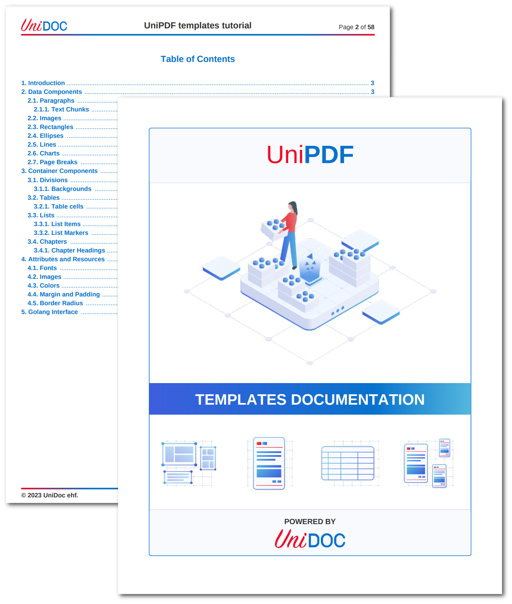

Documentation
=============

This is the official documentation for the creator templates feature. However,
it can also serve as a technical documentation/tutorial example.  
Documentation PDF file: [unipdf-templates-documentation.pdf](unipdf-templates-documentation.pdf).

    

